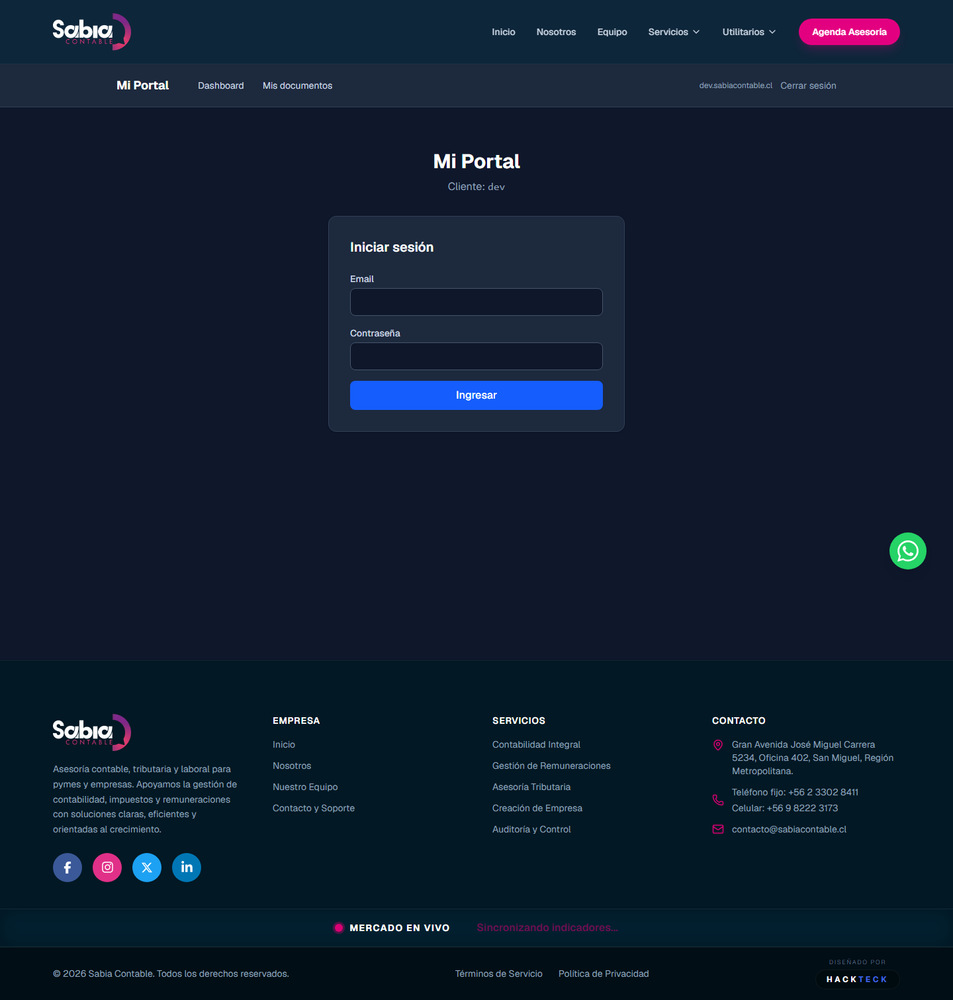
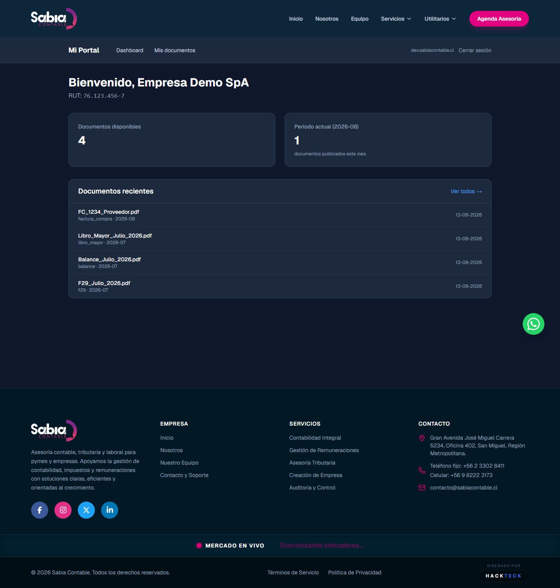
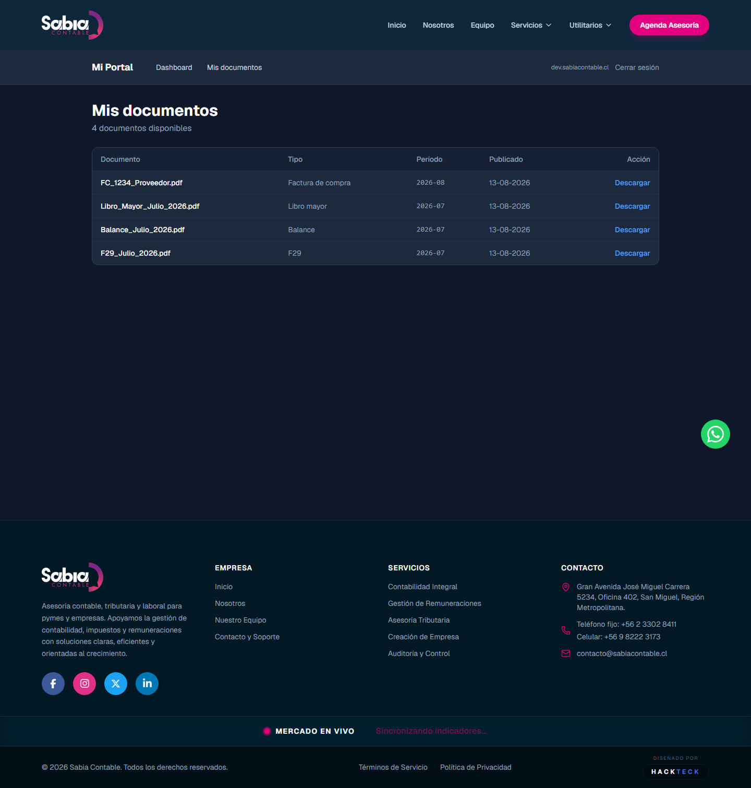

# Manual del Cliente — Sabia Contable

> **Bienvenido a tu portal contable.**
> Este documento te explica cómo usar la plataforma para ver y descargar tus documentos contables en línea, de forma segura y desde cualquier lugar.

---

## 1. ¿Qué es Sabia Contable?

Sabia Contable es la **plataforma online donde tu contador publica los documentos de tu empresa** (boletas, facturas, balances, F29, etc.). En lugar de pedirlos por correo o WhatsApp, los encuentras siempre disponibles en tu portal, ordenados por período y listos para descargar.

### ¿Qué ventajas tiene?

- **Acceso 24/7** desde cualquier dispositivo con internet
- **Tus documentos seguros** — cada empresa tiene su portal aislado
- **Descargas con link temporal** — los links expiran en 5 minutos por seguridad
- **Historial completo** — todos los meses, todos los años
- **Sin instalar nada** — funciona desde el navegador

### ¿Qué necesito para usarlo?

- Un navegador web (Chrome, Firefox, Edge, Safari)
- Tu email y contraseña que te dio tu contador
- Conexión a internet

---

## 2. Cómo entrar al portal

### Paso 1: Abrir el link

Tu contador te dio una URL personalizada, algo como:

```
https://tu-empresa.sabiacontable.cl
```

Abre esa URL en tu navegador. Verás la pantalla de login.

### Paso 2: Iniciar sesión

Vas a ver un formulario como este:



Ingresa tu email y contraseña. Click **"Ingresar"**.

> **¿Olvidaste tu contraseña?** Contacta a tu contador para que te genere una nueva. Por seguridad, el sistema no permite resetearla por email (todavía).

### Paso 3: Primer acceso

La primera vez que entres, tu contador ya tiene que haberte creado una cuenta. Si el sistema dice **"No tienes un cliente asignado"**, avísale — él tiene que vincular tu usuario con tu empresa.

---

## 3. ¿Qué puedo hacer?

### 3.1 Ver mi dashboard (la pantalla principal)

Al entrar, ves tu panel de bienvenida con un resumen del período y los últimos documentos publicados.



**Qué significa cada cosa:**

| Tarjeta | Qué muestra |
|---|---|
| **Documentos disponibles** | Total de documentos visibles para tu empresa |
| **Período actual (YYYY-MM)** | Cuántos se publicaron este mes |
| **Documentos recientes** | Los últimos que se subieron, con tipo y período |

### 3.2 Ver todos mis documentos

Click en **"Mis documentos"** en el menú superior. Verás una tabla con el listado completo.



**Filtros** (próximamente): podrás filtrar por período o tipo de documento.

### 3.3 Descargar un documento

1. En la lista, click **"Descargar"** al lado del documento.
2. Se genera un link temporal (válido por **5 minutos**).
3. Se abre una nueva pestaña del navegador.
4. El documento se descarga a tu computador.

> **¿Por qué expira en 5 minutos?** Por seguridad. Si alguien captura el link, solo tiene 5 minutos para usarlo. Después deja de funcionar.

> **¿Problemas con la descarga?** Si el link expiró, click otra vez "Descargar" para generar uno nuevo.

### 3.4 Cerrar sesión

Cuando termines, click **"Cerrar sesión"** arriba a la derecha. Esto protege tu información si compartes el computador.

---

## 4. ¿Qué NO puedo hacer?

Por seguridad, **el portal es de solo lectura**. Esto es intencional:

| Lo que NO puedes | Por qué |
|---|---|
| Modificar o borrar documentos | Para mantener la integridad contable y legal |
| Ver documentos de otras empresas | Cada empresa tiene su portal aislado |
| Ver documentos "internos" del contador | Tu contador decide qué se publica y qué no |
| Subir documentos | Los documentos los sube el contador (próximamente podrás hacerlo tú) |
| Enviar mensajes al contador | Próximamente habrá un chat integrado |

---

## 5. Seguridad y privacidad

### ¿Dónde están mis datos?

- En una **base de datos aislada** solo para tu empresa.
- En **servidores en Chile** (o donde tu contador haya configurado).
- Con **encriptación** en tránsito (HTTPS) y en reposo.

### ¿Quién puede ver mis documentos?

- **Tú** (con tu usuario y contraseña)
- **Tu contador y su equipo** (los que tengan acceso a tu empresa)
- **El superadmin** de la firma (solo para soporte técnico, ve logs de acceso pero no contenido)

> Tu contador **NO puede** ver documentos de otras empresas. Solo ve los tuyos.

### ¿Qué pasa si pierdo mi contraseña?

Contacta a tu contador. Él puede generar una nueva desde el panel de administración.

### ¿Qué pasa si alguien más accede a mi cuenta?

- El sistema registra cada acceso (fecha, hora, IP) en el `audit_log`.
- Si ves algo sospechoso, avisa a tu contador inmediatamente.
- El superadmin puede revisar el historial de accesos y cerrar la sesión remotamente.

---

## 6. Próximamente — Lo que viene

Tu contador está trabajando en mejoras. Esto es lo que viene en los próximos meses:

### Notificaciones por email (Fase 6)

> **Qué cambia para ti:** te llega un email cada vez que tu contador publica un documento nuevo. Ya no tienes que entrar al portal para revisar.

Ejemplo:

> *Asunto: Nuevo documento contable disponible — Período 2026-08*
>
> Hola, Empresa Demo SpA.
> Tu contador acaba de publicar un nuevo documento:
> **F29_Agosto_2026.pdf** (F29, período 2026-08)
>
> Ver en el portal: [link]

### Reportes y resúmenes (Fase 7)

> **Qué cambia para ti:** además de los documentos sueltos, podrás ver resúmenes visuales: gráficos de ventas vs. compras por mes, evolución de tu balance, resumen anual.

### Subir tus propios documentos (Fase 3.5)

> **Qué cambia para ti:** podrás subir boletas de compra, facturas recibidas, comprobantes de pago, etc. directo desde el portal. Tu contador las recibe y las procesa.

### Mensajería con tu contador (Fase 4)

> **Qué cambia para ti:** un chat integrado en el portal para hacerle preguntas o pedir aclaraciones sobre documentos específicos.

### App móvil (post-MVP)

> **Qué cambia para ti:** una app nativa para tu celular con notificaciones push.

### Integración con bancos (post-MVP)

> **Qué cambia para ti:** conciliación bancaria automática. Tu contador ve los movimientos del banco directamente.

---

## 7. Preguntas frecuentes

**¿Puedo ver documentos de meses anteriores?**
Sí, todos los que tu contador haya publicado. El portal mantiene el historial completo.

**¿Por qué algunos documentos no aparecen?**
Tu contador decide qué se publica. Si esperas un documento y no lo ves, pregúntale. Probablemente está revisándolo antes de publicarlo.

**¿Puedo descargar varios documentos a la vez?**
Por ahora uno a uno. Estamos trabajando en descarga masiva (Fase 5).

**¿Necesito instalar algo?**
No. Funciona desde el navegador web.

**¿Funciona en el celular?**
Sí, la página se adapta a pantallas pequeñas.

**¿Qué hago si no puedo entrar?**

1. Verifica que estés usando la URL correcta (la que te dio tu contador).
2. Verifica tu email y contraseña.
3. Si dice "demasiados intentos", espera 5 minutos.
4. Si sigue sin funcionar, contacta a tu contador.

**¿Mis datos están seguros?**
Sí. La plataforma cumple con buenas prácticas de seguridad:

- Conexión encriptada (HTTPS)
- Contraseñas hasheadas (nunca en texto plano)
- Cada empresa aislada
- Descargas con links temporales
- Registro de todos los accesos

**¿Puedo confiar en los links de descarga?**
Sí. Los links los genera tu propio portal y solo son válidos por 5 minutos. Vienen de tu URL personalizada (ej: `tu-empresa.sabiacontable.cl`).

---

## 8. Soporte

**¿Problemas técnicos o de acceso?**
→ Contacta a tu contador. Él tiene acceso al panel de administración y puede ayudarte.

**¿Dudas sobre un documento específico?**
→ Tu contador también. Cada documento en el portal tiene un número de período (ej: `2026-08`) que te ayuda a referenciarlo.

**¿Quieres sugerir una mejora?**
→ Tu contador recoge feedback y lo pasa al equipo de desarrollo.

---

*Sabia Contable — v1.0 (Fase 4)*
*Tu contador está disponible para ayudarte en lo que necesites.*
