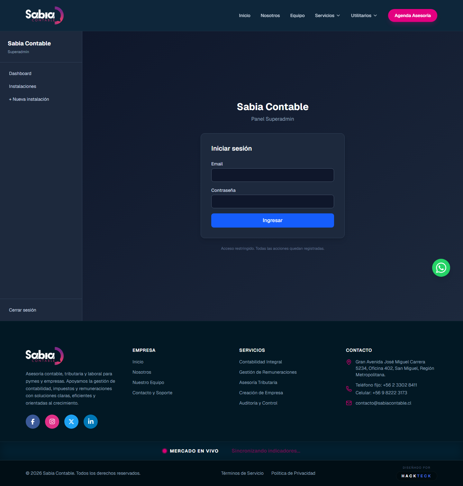
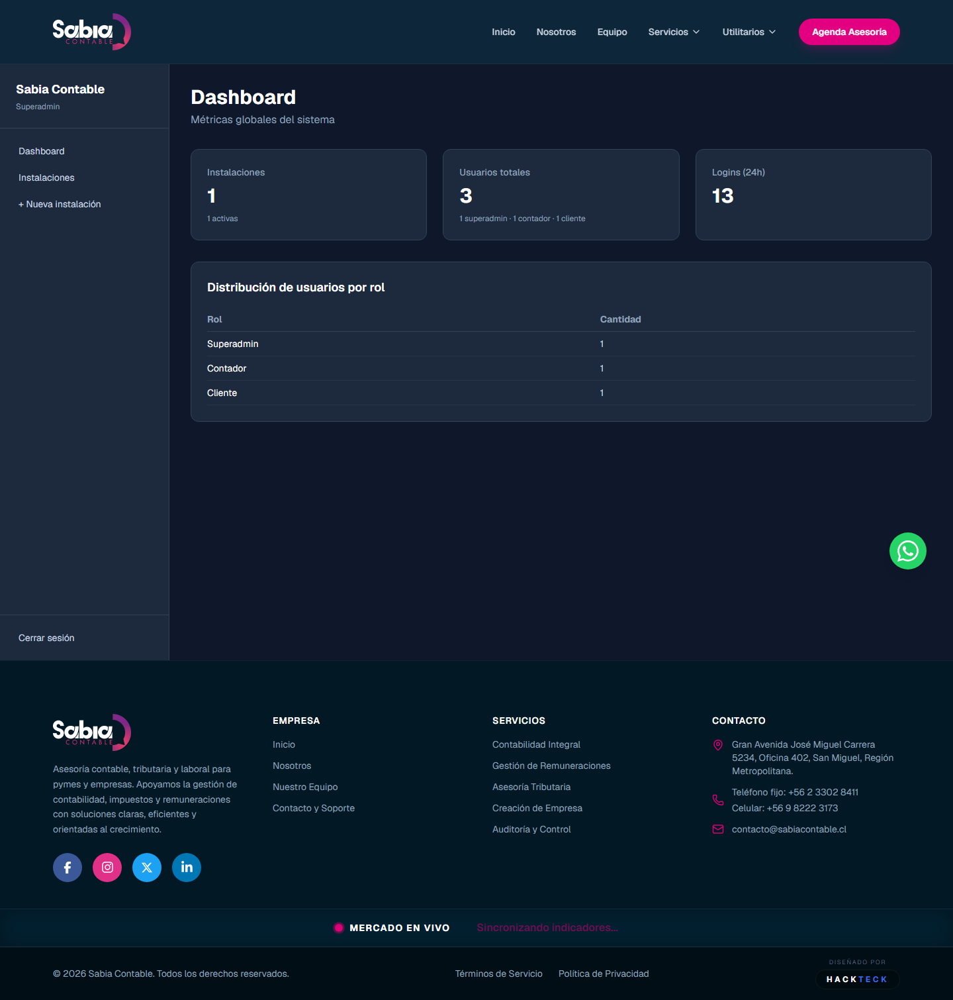
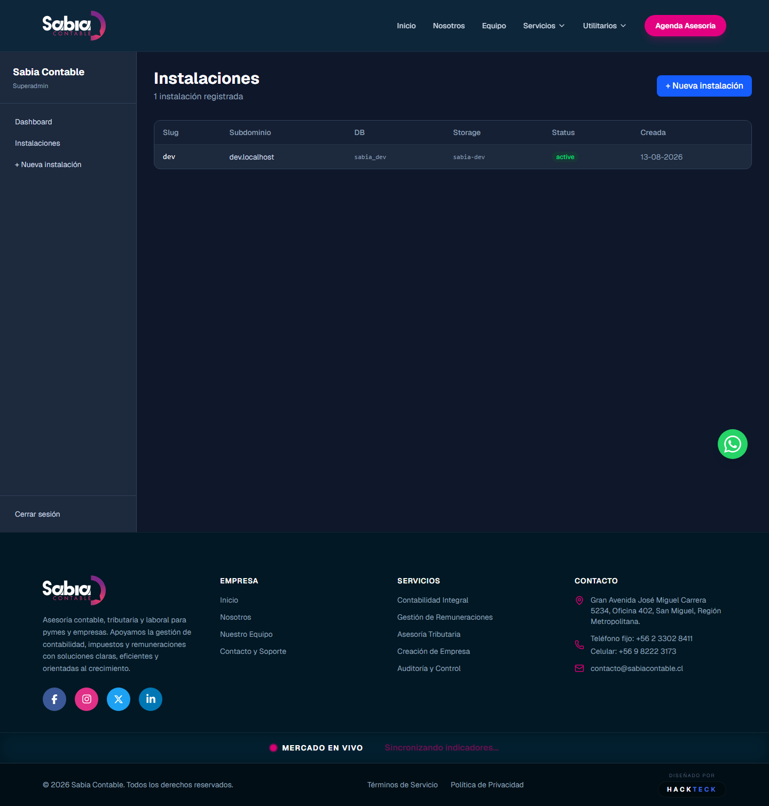
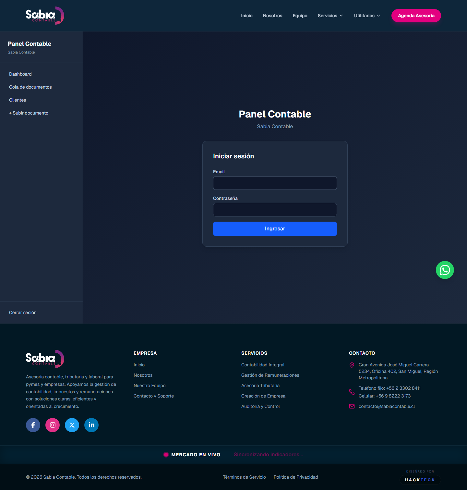
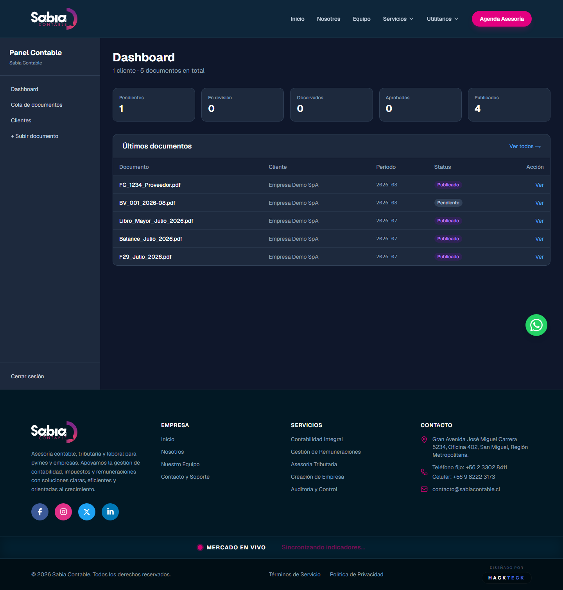
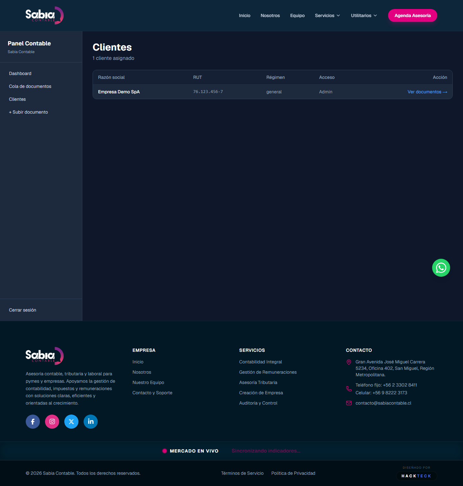
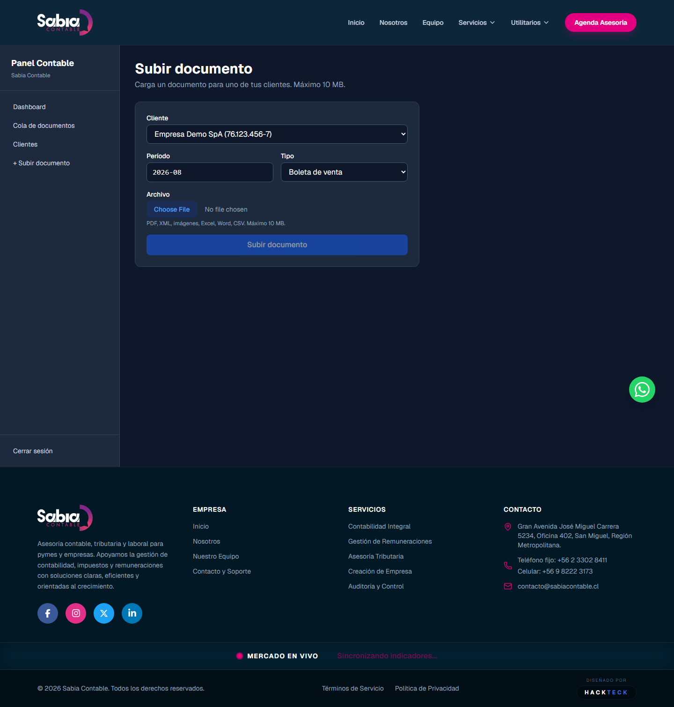
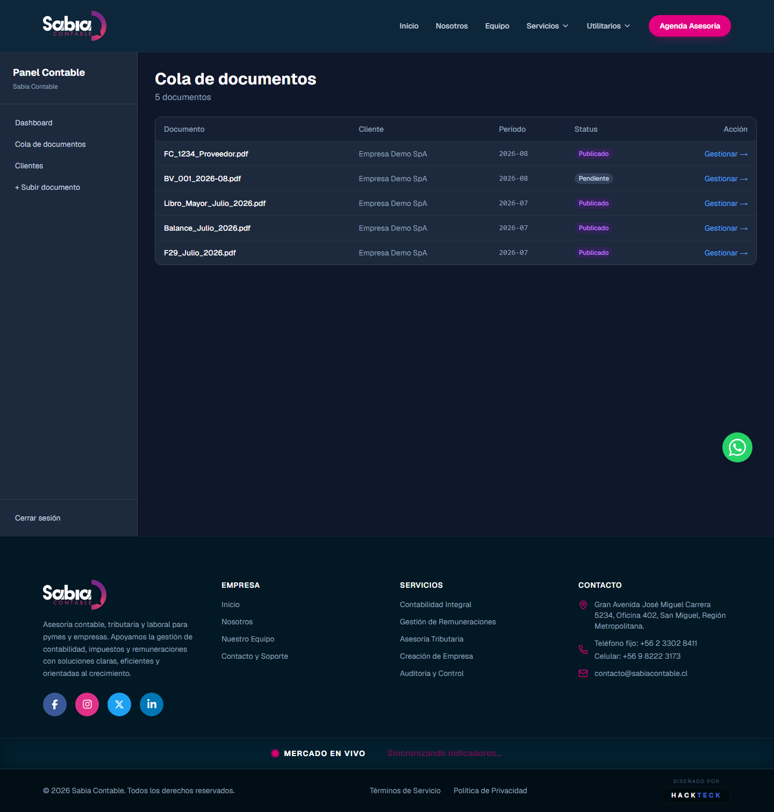

# Manual de Usuario — Sabia Contable

> **Audiencia:** personal interno de la firma (superadmin, contador, asistente)
> **Stack:** Next.js 16 · PostgreSQL 16 · Redis 7 · MinIO (S3) · Resend

---

## 1. ¿Qué es Sabia Contable?

Sabia Contable es una **plataforma web instalable** que conecta el trabajo del contador con la consulta del cliente final. Cada empresa cliente tiene su **propia instalación aislada** (base de datos, archivos, sesiones), accesible por subdominio.

### Tres superficies según rol

| Subdominio | Quién entra | Qué hace |
|---|---|---|
| `admin.sabiacontable.cl` | Superadmin | Crea y gestiona instalaciones de clientes |
| `panel.sabiacontable.cl` | Contador / Asistente | Sube, revisa y publica documentos al cliente |
| `cliente.sabiacontable.cl` | Cliente final | Consulta y descarga los documentos publicados |

---

## 2. Roles y permisos

### 2.1 Superadmin (1 por firma)

**Puede:**

- Ver dashboard con métricas globales (instalaciones, usuarios, logins 24h)
- Crear nuevas instalaciones (genera slug, subdomain, secret, bucket storage)
- Listar, ver y archivar instalaciones
- Gestionar usuarios internos de la firma

**NO puede:**

- Subir documentos contables (es del contador)
- Aprobar ni publicar documentos
- Acceder a datos de clientes contables

### 2.2 Contador (N por firma, 1+ por instalación)

**Puede:**

- Ver el dashboard con la cola global de documentos
- Ver la lista de clientes asignados
- Subir documentos nuevos (PDF, XML, imágenes, Excel, Word, CSV)
- Cambiar status del documento en cualquier momento del flujo
- Aprobar y publicar documentos al portal del cliente

**NO puede:**

- Acceder a clientes no asignados (responde 404 `forbidden_client`)
- Modificar archivos después de subidos
- Eliminar documentos (solo archivar)

### 2.3 Asistente (opcional, N por instalación)

**Puede:**

- Subir documentos
- Cambiar status: `pending → in_review → observed`
- Ver la cola de clientes asignados

**NO puede:**

- Aprobar documentos (transición a `approved`)
- Publicar documentos (transición a `published`)

> **Regla clave:** un asistente nunca tiene la última palabra. El contador revisa antes de publicar.

### 2.4 Cliente (N por instalación, normalmente 1)

**Puede (vía portal):**

- Ver solo los documentos marcados como `visible_to_client = true`
- Descargar con URL firmada (expira en 5 minutos)
- Ver KPIs del período actual

**NO puede:**

- Ver documentos internos ni de otros clientes
- Subir documentos (Fase 3.5)
- Enviar mensajes al contador (Fase 4)

---

## 3. Guía paso a paso — Superadmin

### 3.1 Iniciar sesión

La URL del panel superadmin en producción es `https://admin.sabiacontable.cl` y en desarrollo `http://admin.localhost:3010`. Ingresa con tu email y contraseña.



> **¿Olvidaste tu contraseña?** Contacta a otro superadmin o resetea vía el script de seed inicial. El sistema no permite reset por email todavía (Fase 8).

### 3.2 Dashboard principal

Después del login ves el dashboard con métricas globales de la firma: instalaciones activas, usuarios totales, logins en las últimas 24 horas y log de actividad reciente.



### 3.3 Crear una nueva instalación

1. Click en **"Instalaciones"** en el sidebar.
2. Click en **"+ Nueva instalación"**.



3. Llenar el formulario:
   - **Slug** (ej: `cliente-xyz`) — solo minúsculas, números, guiones
   - **Subdominio** (ej: `cliente-xyz.sabiacontable.cl`) — se auto-completa
   - **DB name** (ej: `sabia_cliente_xyz`) — se auto-completa
   - **Storage bucket** (ej: `sabia-cliente-xyz`) — se auto-completa
4. Click **"Crear instalación"**.
5. **MUY IMPORTANTE:** copiar el `panelApiToken` que aparece una sola vez y guardarlo en el gestor de secretos (1Password / Bitwarden). No se puede volver a ver.

> El token se usa para comunicación interna entre el panel contable y la API. Si se pierde, hay que regenerarlo manualmente en la base de datos.

---

## 4. Guía paso a paso — Contador / Asistente

### 4.1 Iniciar sesión

La URL del panel contable en producción es `https://panel.sabiacontable.cl` y en desarrollo `http://panel.localhost:3010`.



### 4.2 Dashboard principal

Después del login ves el dashboard con la cola global de documentos: contadores por status (pendientes, en revisión, observados, aprobados, publicados) y la lista de los últimos 5 documentos con su estado.



### 4.3 Ver clientes asignados

Click en **"Clientes"** en el sidebar. La tabla muestra todos los clientes que tenés asignados, con su RUT, nombre comercial, documentos del período actual y la cantidad de documentos totales.



### 4.4 Subir un documento

1. Click en **"+ Subir documento"** en el sidebar.
2. Seleccionar el cliente (si tenés varios).
3. Período en formato `YYYY-MM` (ej: `2026-08`).
4. Tipo de documento (boleta, factura, F29, balance, etc.).
5. Marcar **"Visible para el cliente"** si querés que aparezca en el portal apenas se publique.
6. Seleccionar el archivo (PDF, máx 10 MB).
7. Click **"Subir documento"**.
8. El documento entra en la cola con status `pending`.



> El archivo se sube a MinIO/S3 con un nombre UUID (no el original). El nombre original va en la base de datos. El hash sha256 se calcula para integridad.

### 4.5 Revisar y publicar

1. Ir a **"Cola de documentos"** o al cliente específico.
2. Ver un documento (click "Ver").
3. Cambiar status según el flujo:

```
   pending  →  in_review  →  observed  →  approved  →  published
       │           │             │             │
       └───────────┴─────────────┴─────────────┘
                          (cualquier → archived)
```



4. **`in_review → approved`**: significa "el documento es correcto".
5. **`approved → published`**: significa "el cliente ya puede verlo". Click **"🚀 Publicar al portal"**.
6. En el momento de publicar, el cliente ve el documento en su portal (si está logueado) y recibe un email de notificación (Fase 6 — pronto).

### 4.6 Si el documento tiene un error

1. En la página de detalle, click **"Observar"**.
2. El status pasa a `observed` (no se publica).
3. Subir el documento corregido (crea uno nuevo en `pending`).
4. Archivar el viejo desde la página de detalle.

---

## 5. Seguridad y auditoría

### 5.1 Lo que se valida automáticamente

| Validación | Dónde |
|---|---|
| JWT firmado con HS256 + `AUTH_SECRET` único por instalación | `src/lib/auth/jwt.ts` |
| Cookies `httpOnly` + `secure` (en prod) + `sameSite=lax` | `src/lib/auth/session.ts` |
| Rate limit en login: 5 req / 5 min por IP+email | `src/lib/auth/rate-limit.ts` (Redis) |
| Lockout tras 10 intentos fallidos: 30 min | `src/app/api/auth/login/route.ts` |
| CSRF en mutaciones (POST/PUT/PATCH/DELETE) | `src/lib/auth/csrf.ts` |
| `client_id` SIEMPRE desde sesión (nunca del request) | `src/lib/auth/portal-context.ts` |
| Filtro `visible_to_client = true` en TODA query del portal | `src/app/api/portal/**` |
| URLs firmadas expiran en 5 min (hard limit 10 min) | `src/lib/storage/signed-url.ts` |
| Validación MIME + extensión + tamaño en upload | `src/lib/storage/upload.ts` |
| Audit log en login, logout, refresh, publish, download, etc. | `src/lib/auth/audit.ts` |

### 5.2 Qué se loguea en `audit_log`

| Acción | Cuándo |
|---|---|
| `login_success` / `login_failed` / `login_locked` | Login |
| `logout` | Logout |
| `refresh_token` | Refresh de access token |
| `document_uploaded` | Upload desde panel |
| `document_published` | Publicación al portal |
| `document_downloaded` | Descarga desde portal |
| `installation_created` | Creación de instalación |
| `user_created` / `user_updated` | Gestión de usuarios (futuro) |

Cada registro tiene: `userId`, `action`, `resourceType`, `resourceId`, `ipAddress`, `userAgent`, `metadata`, `createdAt`.

### 5.3 Headers de seguridad (nginx)

- `Strict-Transport-Security: max-age=31536000; includeSubDomains`
- `X-Frame-Options: SAMEORIGIN`
- `X-Content-Type-Options: nosniff`
- `Referrer-Policy: strict-origin-when-cross-origin`
- `Content-Security-Policy` con whitelist estricta

---

## 6. Comandos útiles

### 6.1 Levantar el entorno local

```bash
cd G:\DESARROLLOS\sabia_2

# 1. Levantar stack (Postgres, Redis, MinIO, Next.js, Nginx)
docker compose up -d

# 2. Esperar healthchecks (10-15s)
docker compose ps

# 3. Aplicar migraciones
docker compose exec -T app npx tsx src/lib/db/migrate.ts

# 4. Sembrar datos de prueba (3 usuarios + 1 cliente + 5 documentos)
docker compose exec -T app npm run db:seed
```

URLs locales (apuntan a `127.0.0.1:80` vía nginx):

- `http://admin.localhost` — superadmin
- `http://panel.localhost` — contador
- `http://dev.localhost` — portal cliente dev

### 6.2 Credenciales de prueba (seed)

| Rol | Email | Contraseña |
|---|---|---|
| Superadmin | `admin@sabiacontable.cl` | `Admin123!` |
| Contador | `contador@sabiacontable.cl` | `Contador123!` |
| Cliente | `cliente@sabiacontable.cl` | `Cliente123!` |

> **Estas credenciales son SOLO para desarrollo.** En producción, los usuarios se crean vía provisioning (Fase 9).

### 6.3 Reset de rate limit

Si alguien se quedó bloqueado por muchos intentos fallidos:

```bash
docker exec sabia_redis redis-cli FLUSHDB
```

### 6.4 Backup de la base de datos

```bash
# Backup completo
docker exec sabia_db pg_dump -U sabia_user sabia_dev > backup_$(date +%Y%m%d).sql

# Restaurar
cat backup_20260813.sql | docker exec -i sabia_db psql -U sabia_user -d sabia_dev
```

---

## 7. Troubleshooting

| Problema | Solución |
|---|---|
| "Error en el servidor remoto: 502" | Nginx no puede alcanzar el app. Verificar `docker compose ps` y reiniciar nginx |
| "No es posible conectar con el servidor remoto" en `*.localhost:80` | Verificar que docker compose esté corriendo. En Windows, los subdominios `*.localhost` resuelven automáticamente |
| "Credenciales inválidas" repetido | Puede ser rate limit. Reset con `docker exec sabia_redis redis-cli FLUSHDB` |
| "Cuenta bloqueada" | Lockout de 30 min por 10 intentos. Esperar o reset rate limit |
| "CSRF inválido" en una mutación | El cliente (navegador) perdió la cookie CSRF. Recargar la página para regenerar |
| "Forbidden - 403" al subir documento | El user no tiene `user_client_access` para ese cliente. Asignarlo vía SQL o esperar Fase 4 (UI de asignación) |
| El cliente no ve un documento recién publicado | Verificar que `visible_to_client = true` y que el cliente esté en `user_client_access` del cliente contable |

---

## 8. Roadmap: qué viene

El MVP actual cubre el 80% del flujo principal. Las fases pendientes son:

| Fase | Nombre | Beneficio |
|---|---|---|
| **5** | Storage hardening | Antivirus (ClamAV) en uploads, versionado de archivos, retención automática |
| **6** | Notificaciones | Email al cliente cuando se publica un doc, al contador cuando hay observado |
| **7** | Reportes + KPIs | Generación de PDF de balances, dashboard analítico con gráficos |
| **8** | Auditoría + MFA | TOTP para admin/contador, UI de audit log, alertas de seguridad |
| **9** | Provisioning | Script PowerShell para crear nuevas instalaciones en 1 click |
| **10** | Observabilidad | Prometheus + Grafana + logs centralizados, alertas |
| **11** | Housekeeping | Migrar `exceljs` legacy, limpiar deps, optimizar bundle |

Cada fase es 1-2 días de trabajo y mantiene backward compatibility (no rompe el flujo actual).

---

## 9. Contacto y soporte

- **Repositorio:** https://github.com/Renanakin/sabia_2
- **Documentación técnica:** `docs/ORQUESTADOR.md` (sistema de fases)
- **Reportes por fase:** `docs/REPORTES/fase-NN.md` (qué se hizo, qué se probó, qué queda)
- **Política de seguridad:** `docs/SISTEMA.md`
- **Spec de subagentes:** `docs/agentes/*.md`
