# Sabia Contable — Presentación del Producto

> **Plataforma contable por empresa.** Cada cliente con su propia instalación aislada, accesible por subdominio. Contador y cliente conectados, sin papeles ni WhatsApp.

---

## 1. Resumen ejecutivo

**Sabia Contable** es una plataforma web que conecta el trabajo del contador con la consulta del cliente final. Reemplaza el envío de documentos por correo, WhatsApp o Dropbox por un **portal privado por empresa** donde el cliente encuentra, en cualquier momento, los boletas, facturas, balances y F29 que su contador ya revisó y publicó.

Cada empresa cliente opera en su **propia instalación aislada**: base de datos propia, archivos propios, sesiones propias, dominio propio. La información de tu empresa no se mezcla nunca con la de otros clientes, ni siquiera dentro de la misma firma contable.

---

## 2. El problema que resolvemos

Hoy, la mayoría de las firmas contables en Chile operan con una mezcla ineficiente de canales:

- **Correo electrónico** para enviar boletas y facturas. Se pierde en bandejas llenas, llega tarde, se adjunta mal.
- **WhatsApp** para "mandar el F29". Las imágenes salen cortadas, el cliente nunca encuentra el documento de marzo.
- **Dropbox o Google Drive** compartido. Todos ven todo, no hay control de qué puede ver cada cliente.
- **Carpetas físicas o PDFs en el computador del cliente**. Se pierden en formateos, robos, cambios de contador.

El resultado es el mismo en todos los casos: **el cliente nunca tiene sus documentos a mano cuando los necesita** (un banco, el SII, una auditoría, una diligencia), y el contador pierde horas explicando por correo dónde está cada archivo.

---

## 3. Nuestra solución — tres pilares

### 3.1 Portal privado por empresa

Cada cliente accede a su propio portal mediante una URL personalizada del estilo `tu-empresa.sabiacontable.cl`. Inicia sesión con su email y contraseña, y encuentra solo **sus** documentos, organizados por período y tipo. Nadie más ve lo suyo.

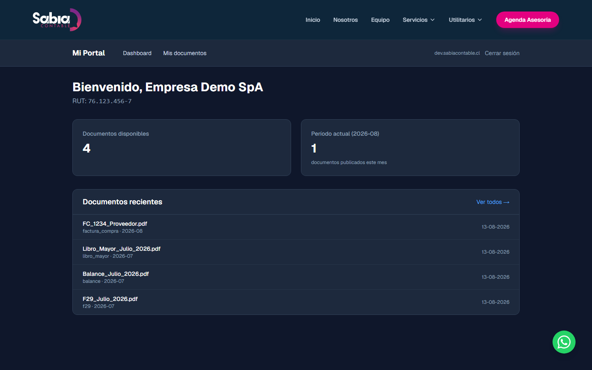

### 3.2 Subida y revisión desde el panel del contador

El contador y su equipo trabajan desde un panel centralizado: suben el documento, lo revisan, lo aprueban y lo publican al portal del cliente. El flujo es auditado en cada paso: queda registro de quién hizo qué, cuándo y desde qué IP.

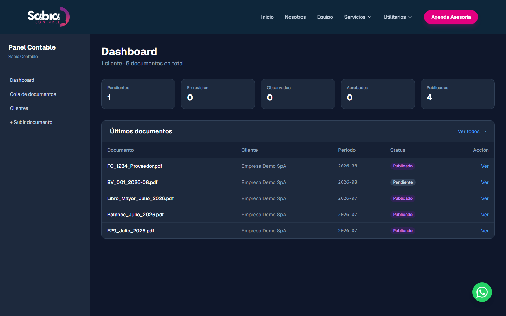

### 3.3 Descargas con links temporales

Cuando el cliente descarga un documento, el sistema genera un **link firmado que expira en cinco minutos**. Si alguien captura el link, solo tiene cinco minutos para usarlo. Pasado ese plazo, deja de funcionar. Es seguridad por diseño, sin fricción para el usuario legítimo.

---

## 4. Una mirada al producto

A continuación, capturas reales del sistema en funcionamiento, con datos de demostración. Verás las tres superficies según rol: marketing público, panel del contador y portal del cliente.

### 4.1 La cara pública — el sitio que ven los prospectos

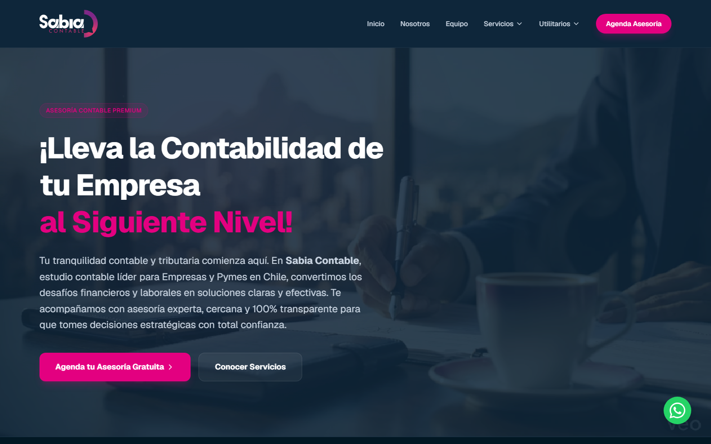

El sitio público explica los servicios de la firma contable, los planes, el equipo y los datos de contacto. No es parte del portal privado: es la vidriera para captar nuevos clientes.

### 4.2 Panel del contador — donde se hace el trabajo

El contador inicia sesión desde `https://panel.sabiacontable.cl` y entra a su cola de trabajo:

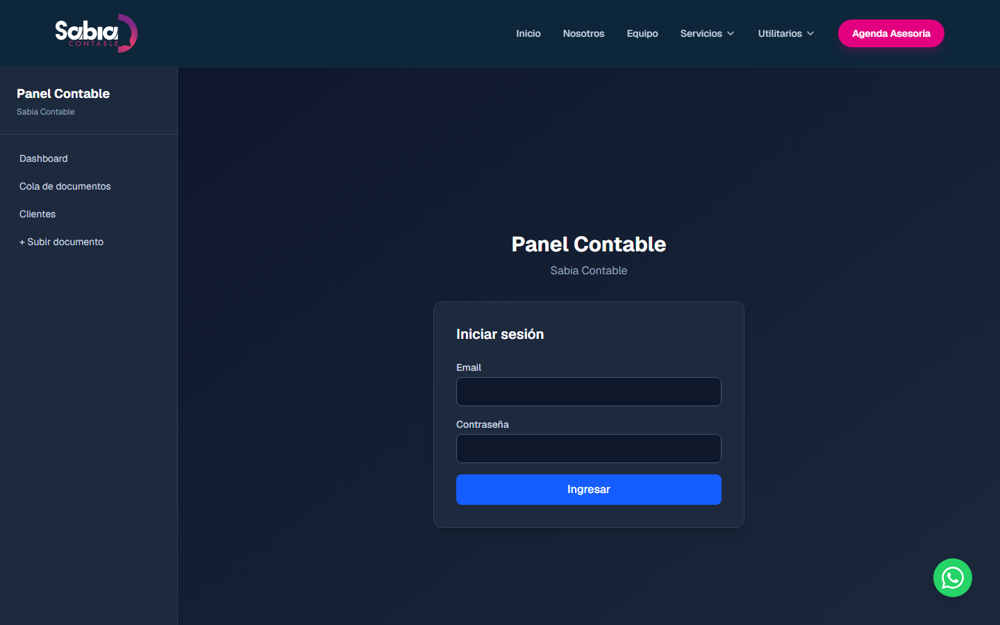

El dashboard le muestra, de un vistazo, cuántos documentos tiene en cada estado del flujo y cuáles son los últimos cinco movimientos:

Ve los **clientes que tiene asignados**, con su RUT, su último período activo y la cantidad de documentos asociados:

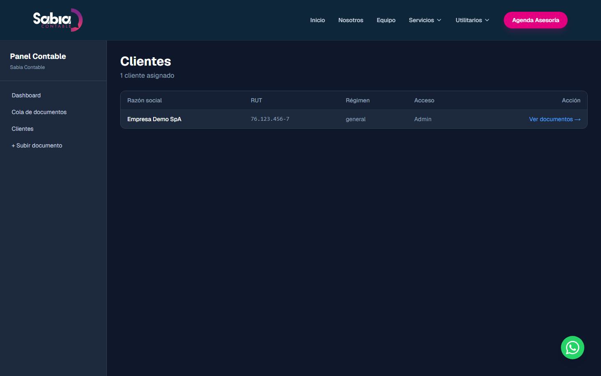

La **cola de documentos** muestra todos los que están en cualquier estado. Un click lo lleva al detalle para cambiar de `pendiente` a `en revisión`, `observado`, `aprobado` o `publicado`:

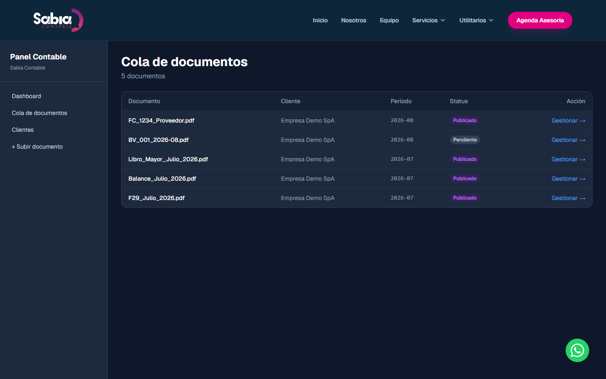

Para subir un documento nuevo, completa un formulario simple: cliente, período, tipo, archivo. El sistema lo guarda con un nombre UUID en almacenamiento cifrado, calcula su hash de integridad y lo deja en la cola con estado `pendiente`:

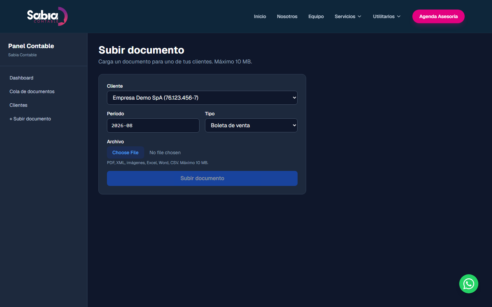

### 4.3 Panel superadmin — la operación de la firma

El superadmin de la firma (uno por oficina) gestiona las **instalaciones** de cada cliente. Cada instalación es un subdominio, una base de datos y un bucket de almacenamiento dedicado. Aquí ve el listado de las que tiene activas:

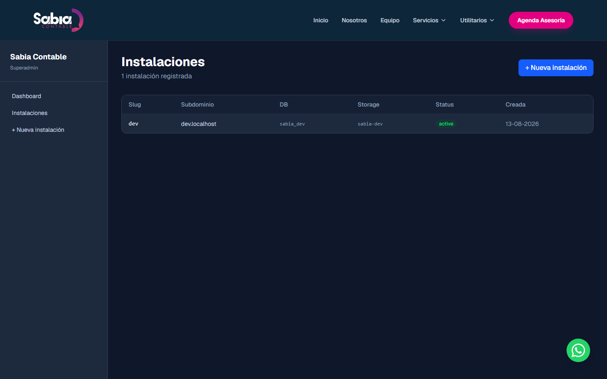

Y desde acá puede **crear una nueva instalación** para un cliente que recién se incorpora a la firma. El sistema genera automáticamente el subdominio, la base de datos y el token de comunicación:

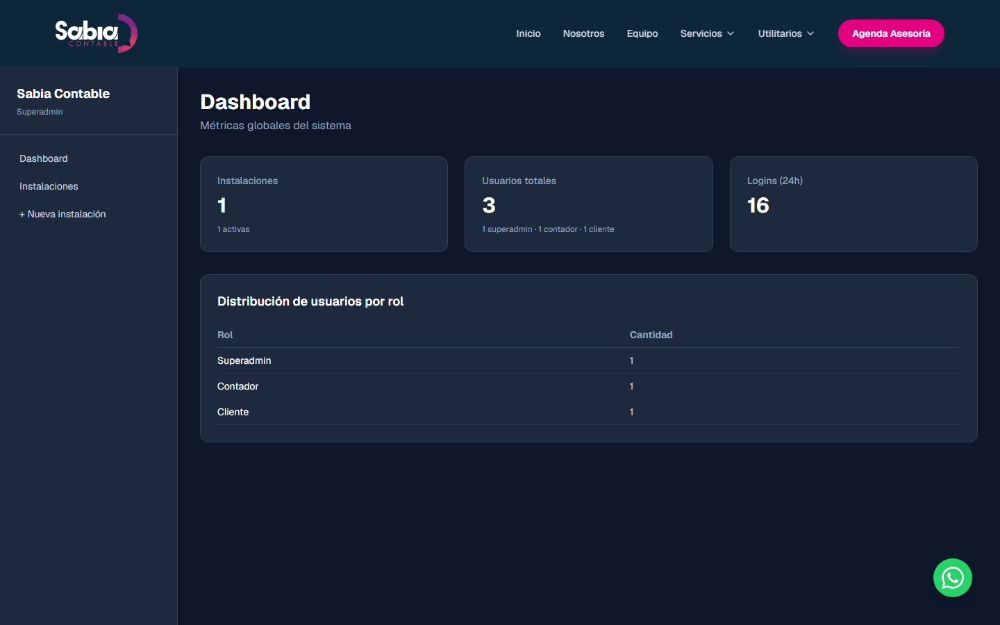

### 4.4 Portal del cliente — donde se consume la información

El cliente entra a su portal personalizado (`https://empresa-demo.sabiacontable.cl`) e inicia sesión:

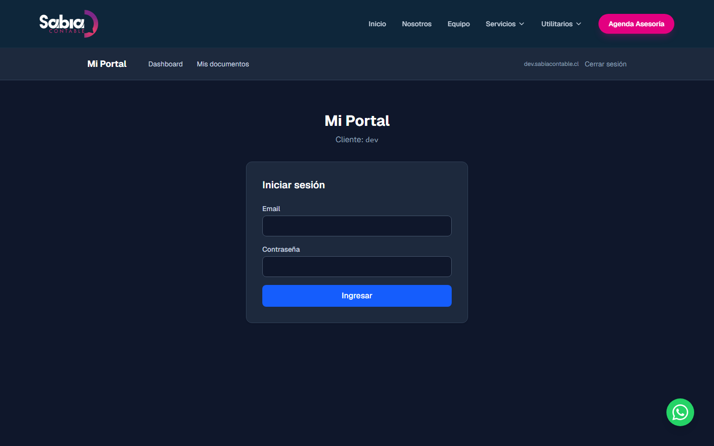

Su dashboard le muestra, de un vistazo, **cuántos documentos tiene disponibles** y **cuántos se publicaron este mes**. Más abajo, los últimos cuatro documentos con su tipo y período:

La vista de **Mis documentos** lista el historial completo, ordenado del más reciente al más antiguo. Cada fila tiene un botón **Descargar** que genera el link temporal:

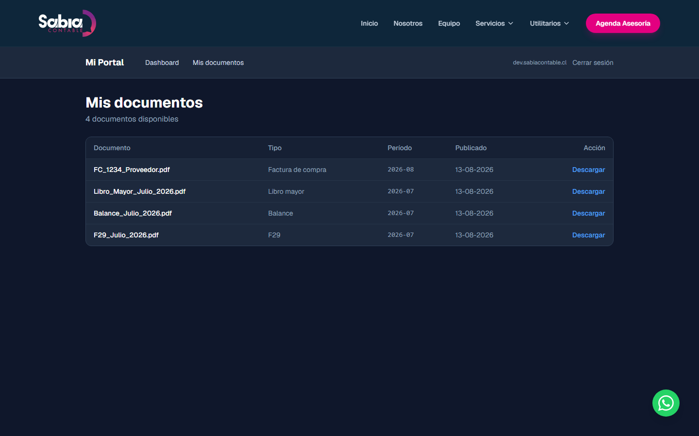

---

## 5. Roles y permisos

La plataforma distingue cuatro roles bien separados, cada uno con permisos acotados al mínimo necesario:

| Rol | Quién | Qué puede hacer | Qué NO puede hacer |
|---|---|---|---|
| **Superadmin** | Dueño o gerente de la firma | Crear instalaciones, gestionar usuarios internos, ver métricas globales | Subir documentos, aprobar ni publicar, ver datos de clientes |
| **Contador** | Contador titular de uno o más clientes | Subir, revisar, aprobar y publicar documentos; ver sus clientes | Acceder a clientes no asignados, modificar archivos ya subidos |
| **Asistente** | Ayudante del contador | Subir documentos, mover a `en revisión` u `observado` | Aprobar ni publicar (siempre requiere firma del contador) |
| **Cliente** | Empresa cliente final | Ver y descargar sus documentos publicados | Ver documentos de otros clientes, subir nada, modificar nada |

> **Regla de oro:** un asistente nunca tiene la última palabra. Toda publicación al portal del cliente requiere la acción de un contador. Esto preserva la integridad contable y la confianza.

---

## 6. Seguridad y privacidad

La seguridad no es un agregado al final: está en el diseño desde el primer día.

### 6.1 Aislamiento por empresa

Cada empresa cliente corre en su **propia instalación**: su propia base de datos PostgreSQL, su propio bucket de almacenamiento MinIO/S3, su propio `AUTH_SECRET` para firmar los tokens de sesión. Un compromiso de seguridad de un cliente no pone en riesgo a los demás. Ni siquiera comparten el mismo proceso de aplicación.

### 6.2 Autenticación robusta

Las contraseñas se almacenan hasheadas con **bcrypt** (costo 12). Las sesiones usan **JWT firmados con HS256** y el secret único de la instalación. Las cookies son `httpOnly`, `secure` (en producción) y `sameSite=lax` para mitigar CSRF.

Adicionalmente, cada intento de login pasa por un **rate limiter en Redis**: cinco intentos por IP+email cada cinco minutos, y un **lockout de treinta minutos** después de diez intentos fallidos consecutivos.

### 6.3 Descargas con links firmados y temporales

Cada descarga genera una **URL firmada con expiración de cinco minutos**, validada además por un `clientId` que viene exclusivamente de la sesión, nunca del request. Un atacante no puede enumerar archivos ajenos ni capturar links para reusar más tarde.

### 6.4 Auditoría completa

Cada acción relevante queda registrada en una tabla `audit_log` con los siguientes campos:

- `userId` del actor
- `action` (login, logout, upload, publish, download, etc.)
- `resourceType` y `resourceId` del objeto afectado
- `ipAddress` y `userAgent` del cliente
- `metadata` adicional en formato JSON
- `createdAt` con marca de tiempo

Esto permite reconstruir cualquier incidente: quién publicó qué, cuándo se descargó un documento, desde qué IP, con qué navegador.

### 6.5 Headers de seguridad y TLS

La aplicación se sirve detrás de **nginx** con TLS forzado en producción y los siguientes headers de seguridad activos:

- `Strict-Transport-Security: max-age=31536000; includeSubDomains`
- `X-Frame-Options: SAMEORIGIN`
- `X-Content-Type-Options: nosniff`
- `Referrer-Policy: strict-origin-when-cross-origin`
- `Content-Security-Policy` con whitelist estricta de orígenes

---

## 7. Beneficios concretos

### Para el cliente

- **Disponibilidad 24/7** desde cualquier dispositivo con navegador.
- **Cero instalaciones**: no hay app que descargar, ni plugin, ni configuración.
- **Trazabilidad**: siempre sabe qué hay disponible, qué se acaba de publicar, qué está en revisión.
- **Confianza**: sus documentos están en servidores con respaldos, no en una bandeja de correo que se puede borrar.
- **Ahorro de tiempo**: cuando necesita un F29 de hace seis meses, lo encuentra en menos de un minuto.

### Para el contador

- **Menos preguntas repetitivas** del tipo "¿ya está el F29?" — el cliente lo ve apenas se publica.
- **Trazabilidad del equipo**: sabe qué subió cada asistente, qué aprobó cada contador.
- **Onboarding de nuevos clientes** en minutos: crear instalación, asignar accesos, empezar a subir.
- **Cero archivos sueltos** en Dropbox, correo o WhatsApp. Todo vive en un solo lugar.
- **Escalable**: agregar un cliente nuevo no agrega complejidad operacional, solo otra instalación.

### Para la firma

- **Imagen profesional**: cada cliente tiene su propia URL, no comparte interfaz con nadie.
- **Cumplimiento**: el audit log completo facilita responder a fiscalizaciones del SII o auditorías externas.
- **Independencia del cliente final**: la plataforma es un servicio que se entrega; no requiere que el cliente instale nada ni aprenda a usar un sistema complejo.
- **Modelo de ingresos recurrentes**: cada instalación activa es un cliente mensual.

---

## 8. Hoja de ruta — lo que viene

La plataforma actual cubre el ochenta por ciento del flujo principal. Las fases siguientes están planificadas y se entregan incrementalmente sin romper lo que ya funciona:

| Fase | Nombre | Qué habilita |
|---|---|---|
| **5** | Endurecimiento de almacenamiento | Antivirus en uploads, versionado de archivos, retención automática según normativa |
| **6** | Notificaciones | Email al cliente cada vez que se publica un documento, alerta al contador cuando hay un documento observado |
| **7** | Reportes y KPIs | Generación de PDF de balances y resúmenes, dashboard analítico con gráficos de ventas y compras por mes |
| **8** | Auditoría y MFA | TOTP para admin y contador, UI de consulta del audit log, alertas de seguridad por patrones anómalos |
| **9** | Provisioning automatizado | Script PowerShell que crea una nueva instalación en un click, pensado para el equipo interno de la firma |
| **10** | Observabilidad | Prometheus, Grafana, logs centralizados y alertas operativas |
| **11** | App móvil | Aplicación nativa iOS y Android con notificaciones push para el cliente |

Cada fase es de uno a dos días de trabajo, con compatibilidad hacia atrás garantizada: el cliente nunca ve una pantalla que no entienda.

---

## 9. Comparación con la forma tradicional

| Aspecto | Cómo se hacía antes | Cómo se hace con Sabia Contable |
|---|---|---|
| **Entrega de documentos** | Por correo o WhatsApp, con archivos adjuntos que se pierden o se desactualizan | El cliente entra al portal y siempre ve la última versión publicada |
| **Búsqueda de un documento viejo** | "Revisar correos de hace seis meses… o preguntarle al contador" | Filtros por período y tipo de documento, con descarga inmediata |
| **Seguridad del archivo** | PDF suelto en una bandeja o carpeta compartida | Link firmado que expira en cinco minutos, auditado por sesión |
| **Visibilidad para el cliente** | "Ya te lo mandé" / "Espera que lo busco" | El cliente ve en su dashboard qué hay disponible y qué se acaba de publicar |
| **Cambio de contador** | "Pídele a tu contador anterior que te los pase" (spoiler: no siempre pasa) | Los documentos del cliente viven en la plataforma; un nuevo contador puede acceder sin pedir nada |
| **Costo de agregar un cliente** | Crear nueva carpeta compartida, nueva cuenta de Drive, nuevos permisos | Crear nueva instalación (un click en el panel superadmin) |

---

## 10. Próximos pasos

Si esta propuesta resuena con lo que necesitás, los próximos pasos son simples:

1. **Demo en vivo** de treinta minutos, donde te mostramos el sistema con tus propios datos de prueba.
2. **Pilotaje** con uno o dos clientes de tu cartera durante treinta días, en producción real.
3. **Onboarding** del primer cliente productivo: alta de instalación, carga inicial de documentos, capacitación de tu equipo.
4. **Rollout gradual** al resto de tu cartera, a tu ritmo.

---

## 11. Quiénes somos

**Sabia Contable** es desarrollada y mantenida por **HackTeck**, un estudio chileno especializado en software para empresas. Trabajamos con contadores, abogados, clínicas y PyMEs que necesitan herramientas sobrias, seguras y sin sorpresas.

---

## 12. Contacto

- **Web:** https://sabiacontable.cl
- **Email:** contacto@sabiacontable.cl
- **Teléfono fijo:** +56 2 3302 8411
- **Celular:** +56 9 8222 3173
- **Oficina:** Gran Avenida José Miguel Carrera 5234, Oficina 402, San Miguel, Región Metropolitana, Chile

> ¿Hablamos? Coordinamos una demo de treinta minutos y te mostramos el sistema funcionando con tus propios números.
